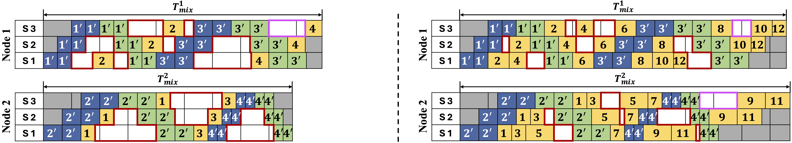

# LeMix
Concurrent Training and Serving of Large Language Models in Distributed Systems

## An illustration of Separate and Co-location strategies under concurrent workloads

The "train-then-inference" paradigm is commonly adopted in the deployment of large language models and other deep learning models, resulting in GPU under-utilization and inconsistent model update in distributed systems. Our empirical analysis reveals that these inefficiencies stem from dynamic request arrivals during serving and workload heterogeneity in pipeline-parallel training. 

- Separate training and inference on a 2-node cluster (each holds 3 sharded stages)
<p align="center">
  
</p>


We first propose a baseline strategy, NaiveMix, which assigns tasks to nodes using a fair Round-Robin (RR) policy based on their in-queue order.
- Co-locate training and inference on a 2-node cluster (each holds 3 sharded stages)
<p align="center">
  
</p>

To further improve the coarse-grained scheduling limitations in NaiveMix, we propose LeMix that can dynamically adapt resource allocation based on workload characteristics and system conditions by understanding task-specific behaviors and resource contention
across shared nodes. LeMix effectively balances the trade-offs between utilization, serving quality, and serving responsiveness.
- LeMix can consolidate active nodes and prioritizes tasks based on workload charactersitics and system conditions
<p align="center">
  
</p>


## Installation

### Setup Environment
- python 3.10
- pytorch 1.13.0+
- Install dependencies
```
conda create -n lemix python=3.10
# Optional: Install CUDA via conda for a smoother installation experience and profiling experiments
pip install -r requirements.txt
```
For more details on installing CUDA via conda, refer to the [CUDA Installation Guide by NVIDIA](https://docs.nvidia.com/cuda/cuda-installation-guide-linux/index.html#conda-installation).

## Evaluation

### Main evaluation (Llama2 & GPT): inference (prefilling) + training (A-PP)
```
bash scripts/main_llama.sh
bash scripts/main_dialogpt.sh
```

### Heterogeneity study (GPT): inference (prefilling) + training (A-PP)
```
bash scripts/LH_study.sh
```

### Ablation study (Llama2): inference (prefilling) + training (A-PP)
```
bash scripts/ablation_study.sh
```

### Synchronous PP (Llama2 & GPT): inference (prefilling) + training (S-PP)
- Separate with GPipe S-PP scheduling (M=2)
<p align="center">
  
</p>

- Co-locate with GPipe S-PP scheduling (M=2)
<p align="center">
  
</p>

- Separate with 1F1B S-PP scheduling (M=2)
<p align="center">
  
</p>

- Co-locate with 1F1B S-PP scheduling (M=2)
<p align="center">
  
</p>

```
bash scripts/llama_SPP.sh
bash scripts/dialogpt_SPP.sh
```

### Autoregressive decoding (Llama2 & GPT): inference (prefilling & decoding) + training (S-PP)
LeMix supports a hybrid iteration-level batching of prefilling and decoding workloads for serving. 
<p align="center">
  
</p>

- Separate with autoregressive decoding (hybrid batching w/ iteration=4) + GPipe S-PP scheduling (M=2)
<p align="center">
  
</p>

- Co-locate with autoregressive decoding (hybrid batching w/ iteration=4) + GPipe S-PP scheduling (M=2). *A* and *B* denote different requests. Subscript *d* represents a decode iteration and *p* represents a prefill operation.
<p align="center">
  
</p>

```
bash scripts/llama_generate.sh
bash scripts/dialogpt_generate.sh
```
- LEMIX consistently achieves the lowest latency in both prefilling (TTFT) and decoding (TBT) phases across all request rates.
<p align="center">
  
  
</p>

